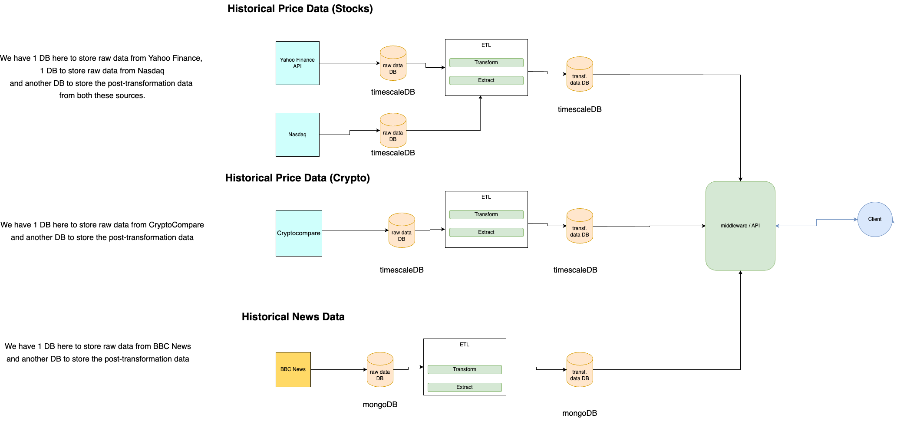

# ETL Introduction
## Background
This ETL (Extract, Transform, Load) micro-service was introduced, to aid in collection of various forms of data such as historical price and historical news data, processing and storing them in our platform.

This will improve data availability for researchers to perform experiments on, bringing great value to their analysis.

## Features

### Data Collection
- **Historical News Data** - BBC News via Hugging Face API
- **Historical Stock Data** - Stock price data from TwelveData API
- **Historical Forex Data** - Forex currency pairs from TwelveData API
- **Historical Crypto Data** - Cryptocurrency data from CryptoCompare API

### Data Warehouse
The ETL service includes a comprehensive data warehouse schema that consolidates time-series data for analytical queries. Key features include:
- Star schema design with fact and dimension tables
- Unified view across stock, forex, and crypto data
- Materialized views for optimized analytical queries
- TimescaleDB continuous aggregates with automatic refresh
- Incremental ETL with scheduled updates
- REST API for warehouse management

The ETL service is developed with maintainability and integration of new data sources in mind for future iterations of the project.

## Architecture
We have defined the following architecture, denoting the flow of data, processes and interactions that will take place in this micro-service. 

The `persistence-middleware` microservice interacts with this `persistence-etl` microservice, to gain access to the transformed data such as historical news and historical price,
and provides it to the front-facing user such as researchers who only have access to the `persistence-middleware` application.
This serves as the only route for these users to gain access to this data as they do not have access to the ETL service.

